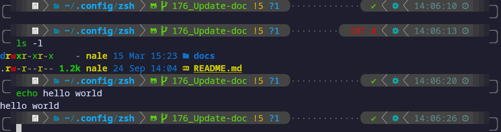

<a name="readme-top"></a>

[![Contributors][contributors-shield]][contributors-url]
[![Forks][forks-shield]][forks-url]
[![Stargazers][stars-shield]][stars-url]
[![Issues][issues-shield]][issues-url]
[![MIT License][license-shield]][license-url]
[![LinkedIn][linkedin-shield]][linkedin-url]
[![NeoVim][NeoVim]][NeoVim-url]


<!-- PROJECT LOGO -->
<br />
<div align="center">
  <a href="https://github.com/Naleeee/Dotfiles">
    
  </a>

<h3 align="center">Nale's Dotfiles</h3>

  <p align="center">
    This is my personal developpment configuration environment.
    <br />
    It contains my Zsh, Terminator and NeoVim configuration !
    <br />
    <a href="https://github.com/Naleeee/Dotfiles"><strong>Explore the docs »</strong></a>
    <br />
    <br />
    <a href="https://github.com/Naleeee/Dotfiles/issues">Report Bug</a>
    ·
    <a href="https://github.com/Naleeee/Dotfiles/issues">Request Feature</a>
  </p>
</div>


<!-- TABLE OF CONTENTS -->
<details>
  <summary>Table of Contents</summary>
  
<!-- vim-markdown-toc Marked -->
* [About The Project](#about-the-project)
  * [Built With](#built-with)
* [Getting Started](#getting-started)
  * [Prerequisites](#prerequisites)
  * [Installation](#installation)
* [Usage](#usage)
* [Roadmap](#roadmap)
* [Contributing](#contributing)
* [License](#license)
* [Contact](#contact)

</details>


<!-- ABOUT THE PROJECT -->
## About The Project

**NeoVim**


**Terminator and Zsh**



### Built With

* [![Lua][Lua]][Lua-url]
* [![Vim Script][Vim-Script]][Vim-Script-url]


<br />

<p align="right">(<a href="#readme-top">back to top</a>)</p>

<!-- GETTING STARTED -->
## Getting Started

This is an example of how you may give instructions on setting up your project locally.
To get a local copy up and running follow these simple example steps.

### Prerequisites

**Nvim:**

Version 0.9

Otherwise some plugins might be broken.

**Zsh:**

Version 5.9

**Terminator:**

Version 2.1

* npm
  ```sh
  npm install npm@latest -g
  ```

### Installation

TBD

<!-- 1. Get a free API Key at [https://example.com](https://example.com) -->
<!-- 2. Clone the repo -->
<!--    ```sh -->
<!--    git clone https://github.com/Naleeee/Dotfiles.git -->
<!--    ``` -->
<!-- 3. Install NPM packages -->
<!--    ```sh -->
<!--    npm install -->
<!--    ``` -->
<!-- 4. Enter your API in `config.js` -->
<!--    ```js -->
<!--    const API_KEY = 'ENTER YOUR API'; -->
<!--    ``` -->

<br />

<p align="right">(<a href="#readme-top">back to top</a>)</p>

<!-- USAGE EXAMPLES -->
## Usage

On a terminal, type `alias` to list the current aliases on zsh.

Use the `v` alias to start NeoVim.

_For more examples, please refer to the related documentation:_

- [Zsh](./zsh/README.md)
- [Terminator](./terminator/README.md)
- [NeoVim](./nvim/README.md)

<br />

<p align="right">(<a href="#readme-top">back to top</a>)</p>

<!-- ROADMAP -->
## Roadmap

- [x] Create Documentation for the repository
- [ ] Only use Lua
- [ ] Create installer script

See the [open issues](https://github.com/Naleeee/Dotfiles/issues) for a full list of proposed features (and known issues).

<br />

<p align="right">(<a href="#readme-top">back to top</a>)</p>

<!-- CONTRIBUTING -->
## Contributing

Contributions are what make the open source community such an amazing place to learn, inspire, and create. Any contributions you make are **greatly appreciated**.

If you have a suggestion that would make this better, please fork the repo and create a pull request. You can also simply open an issue with the tag "feature".
Don't forget to give the project a star! Thanks again!

1. Fork the Project
2. Create your Feature Branch (`git checkout -b feature/AmazingFeature`)
3. Commit your Changes (`git commit -m 'Add some AmazingFeature'`)
4. Push to the Branch (`git push origin feature/AmazingFeature`)
5. Open a Pull Request

<br />

<p align="right">(<a href="#readme-top">back to top</a>)</p>

<!-- LICENSE -->
## License

TBD

<!-- Distributed under the MIT License. See `LICENSE.txt` for more information. -->

<br />

<p align="right">(<a href="#readme-top">back to top</a>)</p>

<!-- CONTACT -->
## Contact

Nathan Lemale - nthn.lemale@gmail.com

Project Link: [https://github.com/Naleeee/Dotfiles](https://github.com/Naleeee/Dotfiles)

<br />

<p align="right">(<a href="#readme-top">back to top</a>)</p>


<!-- MARKDOWN LINKS & IMAGES -->
<!-- https://www.markdownguide.org/basic-syntax/#reference-style-links -->
[contributors-shield]: https://img.shields.io/github/contributors/Naleeee/Dotfiles.svg?style=for-the-badge
[contributors-url]: https://github.com/Naleeee/Dotfiles/graphs/contributors
[forks-shield]: https://img.shields.io/github/forks/Naleeee/Dotfiles.svg?style=for-the-badge
[forks-url]: https://github.com/Naleeee/Dotfiles/network/members
[stars-shield]: https://img.shields.io/github/stars/Naleeee/Dotfiles.svg?style=for-the-badge
[stars-url]: https://github.com/Naleeee/Dotfiles/stargazers
[issues-shield]: https://img.shields.io/github/issues/Naleeee/Dotfiles.svg?style=for-the-badge
[issues-url]: https://github.com/Naleeee/Dotfiles/issues
[license-shield]: https://img.shields.io/github/license/Naleeee/Dotfiles.svg?style=for-the-badge
[license-url]: https://github.com/Naleeee/Dotfiles/blob/main/LICENSE.txt
[linkedin-shield]: https://img.shields.io/badge/-LinkedIn-black.svg?style=for-the-badge&logo=linkedin&colorB=555
[linkedin-url]: https://linkedin.com/in/nathan-lemale
[product-screenshot]: images/screenshot.png
[Lua]: https://img.shields.io/static/v1?style=for-the-badge&message=Lua&color=2C2D72&logo=Lua&logoColor=FFFFFF&label
[Lua-url]: https://nextjs.org/
[Neovim]: https://img.shields.io/static/v1?style=for-the-badge&message=Neovim&color=57A143&logo=Neovim&logoColor=FFFFFF&label
[NeoVim-url]: https://neovim.io/
[Vim-Script]: https://img.shields.io/static/v1?style=for-the-badge&message=Vim&color=019733&logo=Vim&logoColor=FFFFFF&label
[Vim-Script-url]: https://devhints.io/vimscript
