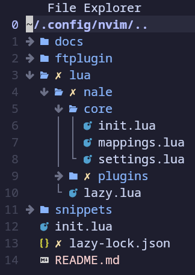
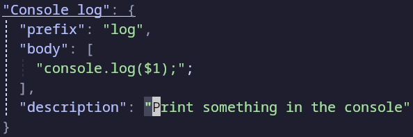
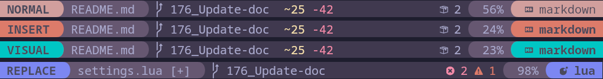
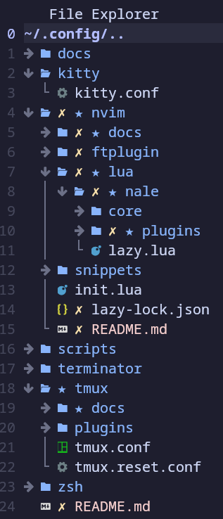
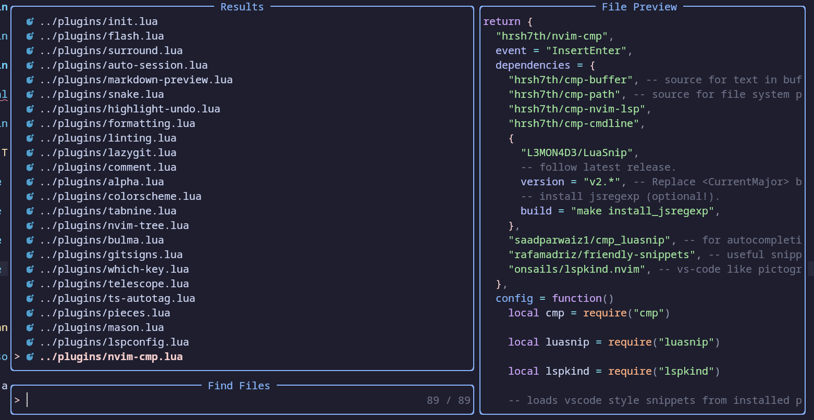
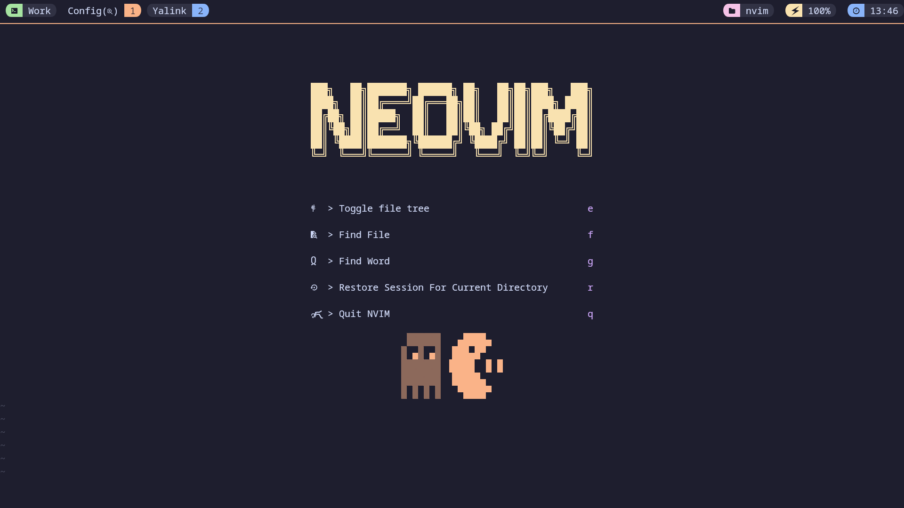

# NeoVim Configuration

## Overview

### Preview


## Table of Contents

* [File Structure](#file-structure)
  * [Lua - Mappings](#lua-mappings)
  * [Lua - Plugins](#lua-plugins)
    * [Configuration](#configuration)
  * [Snippets](#snippets)
  * [Settings](#settings)
* [Features](#features)
  * [Buffer and Status Lines](#buffer-and-status-lines)
  * [File Tree and Navigation](#file-tree-and-navigation)
  * [LSP and Auto Completion](#lsp-and-auto-completion)
  * [Color Scheme](#color-scheme)
  * [Start-Up Page](#start-up-page)

## File Structure

My configuration is fully written in Lua.

Here is the file structure:



### Lua - Mappings

In the Lua folder, you can find the `mapping.lua` file.

It creates and sets up every global mappings.

The plugin-specific mappings are in the configuration file of each plugin.

### Lua - Plugins

I am using [Lazy](https://github.com/folke/lazy.nvim) as a plugin manager.

Plugins are loaded from lazy, which is configured in the `lazy.lua` file.

#### Configuration

Every plugin's installation and configuration are located in the folder `lua/nale/plugins/`.

They are titled by the plugin's name.

### Snippets

I set all my snippets in the dedicated folder with [LuaSnip](https://github.com/L3MON4D3/LuaSnip) plugin.

Each file must be correctly named according file type in which they are used.

Since snippets are mostly personal, I would recommend creating your own.



To create a snippet, follow this template:

```json
"Snippet title": {
  "prefix": "Snippet Prefix",
  "body": [
    "Content",
    "Of The",
    "Snippet"
  ],
  "description": "Snippet Description"
}
```

### Settings

The global settings are located at [settings.vim](./settings.vim).

Here you can find global settings such as:

* Displaying line numbers
* Setup line breaks
* ...

## Features

Here are a list of the main features of my configuration:

### Buffer and Status Lines

**[Buffer Line](https://github.com/akinsho/bufferline.nvim)**


**[Status Line](https://github.com/nvim-lualine/lualine.nvim)**

I use [Lualine](https://github.com/nvim-lualine/lualine.nvim) as status bar, which I fully customized.



### File Tree and Navigation

**[Nvim Tree](https://github.com/nvim-tree/nvim-tree.lua) example**



**[Telescope](https://github.com/nvim-telescope/telescope.nvim)** for listing elements such as files, greps or mappings...



### LSP and Auto Completion

I use [Mason](https://github.com/williamboman/mason.nvim) paired to [Nvim lsp Config](https://github.com/neovim/nvim-lspconfig) to handle LSP servers.

[Nvim Cmp](https://github.com/hrsh7th/nvim-cmp) and [Tabnine](https://github.com/tzachar/cmp-tabnine) are used for auto completion.

### Color Scheme

I currently use [Catppuccin](https://github.com/catppuccin/nvim) as color scheme, paired with the catppuccin tmux theme it makes it beautiful to use.

### Start-Up Page

[Alpha Nvim](https://github.com/goolord/alpha-nvim) is a cool plugin which create a startup page.

I've set many ascii arts on the config file, displayed both on top and bottom of the page.



For the complete list of the plugins, checkout the files in the `lua/nale/plugins/` folder.
