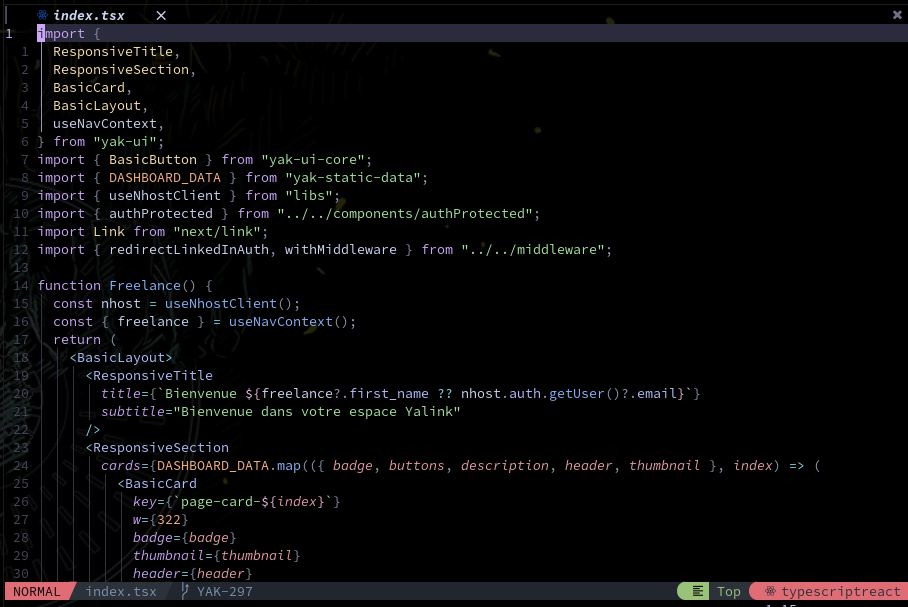
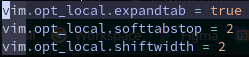
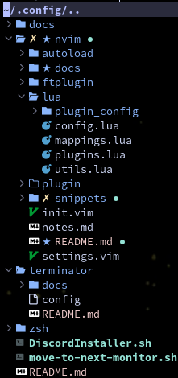

# NeoVim Configuration

## Overview

### Home Screen


### Code Example



## File Structure

My configuration is almost fully written in Lua.

Here is the file structure:


<br />

### Ft Plugin

Configuration for every file types

Here you can setup indent, tabwidth etc...

Example with typescript configuration:



<br />

### Lua - Mappings

In the Lua folder you can find the `mapping.lua` file.

It create and setup every global mappings, the plugins dedicated mappings are in the configuration file of each plugin.

My current leader is "`,`".

<br />

### Lua - Plugins

The loaded plugins are located in `plugins.lua`. 

I am using [Packer](https://github.com/wbthomason/packer.nvim) as plugin manager.

I have split the plugins in 6 parts:

| Section      | Description                                                        |
|--------------|--------------------------------------------------------------------|
| Utils        | Features of the editor                                             |
| Color Scheme | Current color scheme                                               |
| Coding       | Plugins usefull while coding (auto pair brackets, auto completion) |
| Editor       | Composition of the editor                                          |
| UI           | Fancy UI highlights                                                |
| Markdown     | Markdown management                                                |

#### Configuration

Almost every plugins come with an optional custom configuration. They all are located in the `/lua/plugin_config/` folder.

They are tilted by the plugin's name.


<br />

### Snippets

I set all my snippets in the dedicated folder with vim-vnip plugin.

Each file must be correctly named according file type in which they are used.

Since snippets are a lot dedicated to a personal usage I would recommend creating your own ones.


To create a snippet, follow this template:

```json
"Snippet title": {
  "prefix": "Snippet Prefix",
  "body": [
    "Content",
    "Of The",
    "Snippet"
  ],
  "description": "Snippet Description"
}
```

<br />

### Settings

The global settings are located at [settings.vim](./settings.vim).

Here you can find global settings such as:

- Line numbers
- File type management
- ...

<br />

## Features

Here are a list of the main features of my configuration:

### Buffer and Status Lines

**Buffer Line**


<br />

**Status Line**

I use lualine as status bar with a custom design similar to NvChad line.


<br />

### File Tree and Naviguation

**Nvim Tree example**



**Telescope** for file naviguation and live grep


<br />

### Lsp and Auto Completion

I use Mason paired to nvim-lspconfig as a Lsp manager.

nvim-cmp and tabnine are here for auto completion.

<br />

### Color Scheme

I currently use catpputccin as a color scheme, it match well with my transparent vim.

<br />

### Start Up Page

Alpha is a very cool plugin for a startup page.

I've set many ascii arts displayed both on top and bottom of the page.


For the complete list of the plugins checkout the comments in the [plugins.lua](./lua/plugins.lua) file and on this [plugin list](./docs/PluginList.md).
