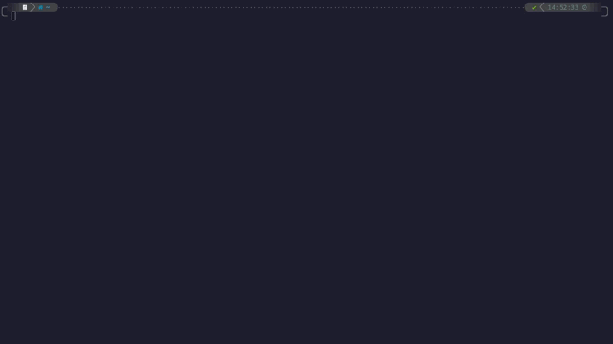

# Tmux Configuration

## Overview

### Preview

## Theme

To keep a matching theme between every dev tools I am using, my tmux theme is [Catppuccin](https://github.com/catppuccin/tmux).

I have edited a bunch of small elements like separators and texts to have a modern visual.

## Plugins

Since Tmux is really configurable it also comes with plugins.

I am installing and managing them with the tool [TPM](https://github.com/tmux-plugins/tpm).

- [Catppuccin](https://github.com/catppuccin/tmux) - Theme
- [Tmux sensible](https://github.com/tmux-plugins/tmux-sensible) - Compilation of useful Tmux features
- [Tmux yank](https://github.com/tmux-plugins/tmux-yank) - Better yank system
- [Tmux battery](https://github.com/tmux-plugins/tmux-battery) - Display icon and battery informations
- [Tmux fzf url](https://github.com/wfxr/tmux-fzf-url) - Allow fuzzy search through url in terminal
