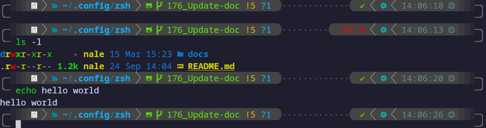

# Zsh Configuration

## Zsh and Oh My Zsh

As a shell, I'm using [Zsh](https://en.wikipedia.org/wiki/Z_shell).

Paired with [Oh My Zsh](https://ohmyz.sh/), it becomes very powerful with strong plugins.

## Theme

For a better-looking terminal, I am using [Power Level 10K](https://github.com/romkatv/powerlevel10k).

It has many cool features and designs available, fully customizable.

Feel free to use my personal theme or setup your own by following the installation steps in the repository.

## Features

### Plugins

- [Git](https://github.com/ohmyzsh/ohmyzsh/tree/master/plugins/git)
- [Zsh Auto Suggestions](https://github.com/zsh-users/zsh-autosuggestions)
- [Zsh Syntax Highlighting](https://github.com/zsh-users/zsh-syntax-highlighting)
- [Dir History](https://github.com/ohmyzsh/ohmyzsh/tree/master/plugins/dirhistory)

### Aliases

I've created some aliases for myself.

Feel free to look at them, use them, or set up your own.
